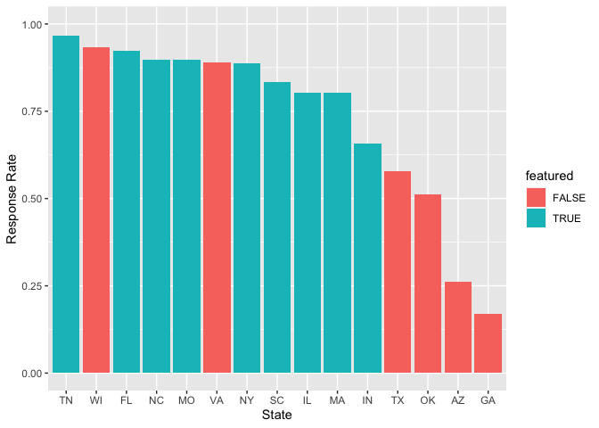

Disparities in Response Rates: An Investigation
================
Brooke Moss, Lily Jiang, Anna Letcher Hartman, Bethany Costello
2023-05-01

- <a href="#background" id="toc-background">Background</a>
  - <a href="#the-dataset" id="toc-the-dataset">The Dataset</a>
  - <a href="#methodology" id="toc-methodology">Methodology</a>
  - <a href="#our-question" id="toc-our-question">Our Question</a>
- <a href="#investigation" id="toc-investigation">Investigation</a>
  - <a href="#questions-v-attorneys-and-hours"
    id="toc-questions-v-attorneys-and-hours">Questions v. Attorneys and
    Hours</a>
  - <a href="#outside-factors" id="toc-outside-factors">Outside Factors</a>
  - <a href="#web-accessibility" id="toc-web-accessibility">Web
    Accessibility</a>
- <a href="#recommendations" id="toc-recommendations">Recommendations</a>
- <a href="#references" id="toc-references">References</a>

## Background

### The Dataset

During DataFest 2023, we were given datasets representing the American
Bar Association’s Free Legal Answer Program (ABA FLA).

<!--# Add additional dataset background -->
<!--# Add discussion of dataset trust -->

### Methodology

Using this data, our team investigated disparities in attorney response
rates across states within the program. In this program, qualifying
users can submit legal questions, which are then “accepted” by an
attorney. The attorney researches the question and communicates back and
forth with the user to answer.

We determined that if an attorney “accepted” a question, taking it into
their purview, we would count that as a question that has been responded
to. However, if no attorney accepted the question, we would count that
as a non-response.

In order to count responses, we used the `TakenByAttorneyUno` variable
from the `questions.csv` dataset. This variable represents the unique
identifier of the attorney that accepted the question. If the column
value was `NULL`, we counted that as a non-response. This is surely an
under-counting of questions that were unresolved, as this column
indicates whether or not an attorney responded to the original question.
This fails to account for non-response cases in which a conversation
occurs between client and attorney before an attorney stops responding
or questions left unresolved.

<!--# Add more discussion of potential causes of uncertainty in the data and our calculations -->

### Our Question

<!--# Add map plot?? -->
<!--# Add `AskedOnUtc` plot?? -->

When digging into response rates, we noticed a large discrepancy between
the two states with the largest number of questions: Texas and Florida.
These states appeared to have begun the FLA program at a similar time
and had a similar number of active attorneys, number of attorney hours,
and questions asked. However, the response rate in Florida was 87%, as
opposed to 47% in Texas. This led to our research question: **what
accounts for the differences in response rates among states?**

## Investigation

We narrowed down the states to investigate by limiting our time scale to
Jan 1st, 2020 to January 24, 2022. We then grabbed the states with
roughly over 100 questions per month, or 2400 questions in total over
two years. These were, in descending order of response rates: Tennessee,
Wisconsin, Florida, North Carolina, Missouri, Virginia, New York, South
Carolina, Illinois, Massachusetts, Indiana, Texas, Oklahoma, Arizona,
and Georgia.

### Questions v. Attorneys and Hours

<!-- -->

<!--# Add plot of Questions v. # of Attorneys -->

To answer this, we calculated the number of unique attorneys per state
that logged any time on the website within our 2 year time scale. We
also calculated the total number of hours per state. This allowed us to
calculate the average time spent per attorney by state. We compared this
against the response rate and created a scatter plot. We also plotted
the average number of questions per active attorney over the response
rate. This allowed us to better explain the disparities found within
Georgia, Oklahoma, and Arizona. All had a low number of hours logged by
the attorney, as well as had a high number of questions per attorney.
This is especially true in Arizona, with almost 160 questions per
attorney. It is clear that demand far outweighs supply in these states.
Texas was not as straightforward. They had a similar number of questions
per attorney as Florida, but with a much lower response rate. Even more
strangely, they had an exorbitant amount of hours spent per question. We
looked to see if there was a higher number of average posts per
question, but Texas didn’t seem to be any different than other states.

### Outside Factors

We turned to outside research to make sense of response variation. We
researched pro bono policies for states. Four of the states (FL, NY, IN,
IL) required attorneys to report the number of pro bono hours per year.
Six states (TN, NC, VA, TX, AZ, GA) allowed attorneys to voluntarily
report the number of pro bono hours per year. The remaining 5 (WI, MO,
SC, MA, OK) had no policy around reporting. There were other interesting
externalities that could be impacting response rates. New York state
requires 50 hours of pro bono work for admission to the Bar. Florida,
Tennessee, and Wisconsin have more of a culture of doing pro bono work
than other states. A 2018 report by the ABA found that Tennessee ranked
2nd in a survey of attorneys in 24 states, with 67% reporting having
done some pro bono work. This is similar to the 57% found in a 2016 pro
bono survey in Wisconsin and the 52% found in a 2006 study of Florida
attorneys. This contrasts greatly with the 38.4% of Texas attorneys that
completed pro bono work found in a 2019 report by the Texas State Bar.
Without access to the surveys that these reports drew upon, it was hard
for us to draw conclusions about the ways in which the culture of pro
bono work differs across states and could affect response rates.

### Web Accessibility

<!-- -->

We also investigated how accessible each state’s ABA FLA was from each
state’s bar association website. For some states, such as Tennessee and
Florida, we found the link to Free Legal Answers featured on the list of
pro bono opportunities for members. For others, such as Oklahoma and
Georgia, the link was hidden among a myriad of in person and remote pro
bono opportunities. We found it difficult to create a metric for this
disparity. We attempted a number of clicks but this was difficult to
standardize among the vastly different website layouts. We finally decided
we would create a boolean variable for whether or not the FLA link was
featured and easily noticeable on the pro bono opportunity website for
lawyers who were not searching outright for the website. Then, we
plotted it. This appeared to have an effect on response rates.

## Recommendations

We would recommend that the ABA ask state bar associations to list the
FLA link among pro bono opportunities for members. We also encourage the
ABA to continue their work with the Baylor University School of Law and
the Stanford Legal Design Lab creating auto emails for users waiting for
an attorney to take their question. These emails containing answers to
frequently asked questions could make a real difference in states with
low response rates. We also urge the ABA to provide more surveys to
Texas attorneys to make sense of the low response rate and large amount
of time spent per question. We want to ensure that this trend does not
continue in other states as this program expands.

<!--# Do we want to elaborate?? -->

## References

- <https://www.tncourts.gov/sites/default/files/docs/atj_2016_pro_bono_report.pdf>
- <https://www.wisbar.org/formembers/probono/Documents/Pro%20Bono%20Survey%20Report_WI%202016.pdf>
- <https://www.floridabar.org/public/probono/probono002/>
- <https://www.americanbar.org/content/dam/aba/administrative/probono_public_service/ls_pb_supporting_justice_iv_final.authcheckdam.pdf>
- <https://www.abalegalprofile.com/pro-bono.php#anchor4>
- <https://www.americanbar.org/groups/probono_public_service/policy/bar_pre_admission_pro_bono/>
- <https://www.americanbar.org/groups/probono_public_service/policy/arguments/>
- <https://www.texasbar.com/Content/NavigationMenu/LawyersGivingBack/LegalAccessDivision/ProBonoSurvey.pdf>
